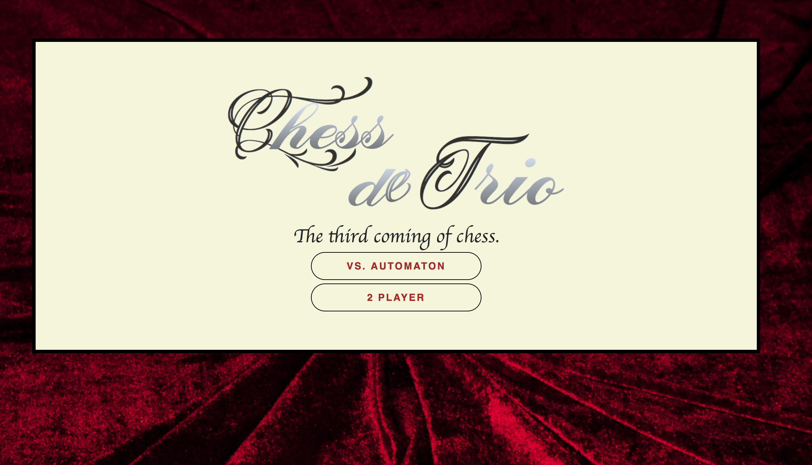
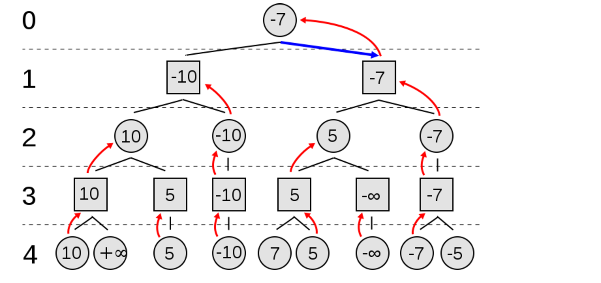
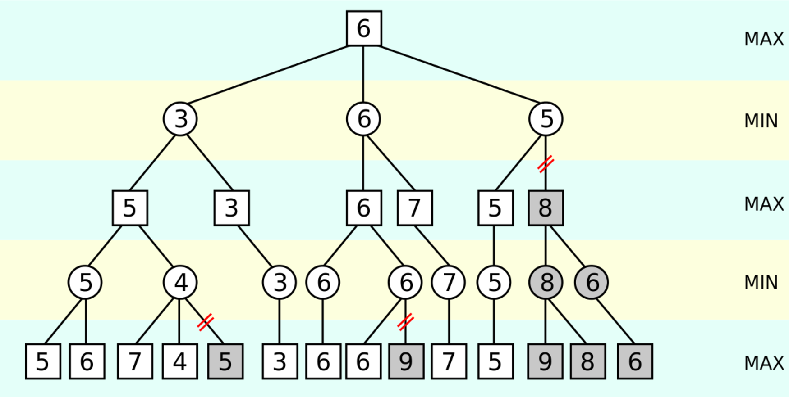
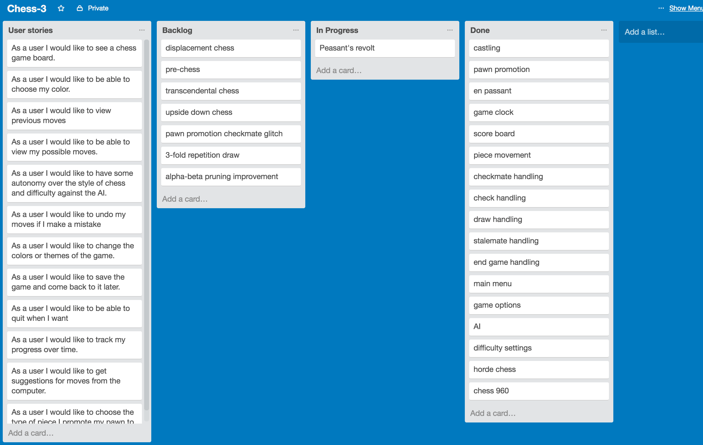
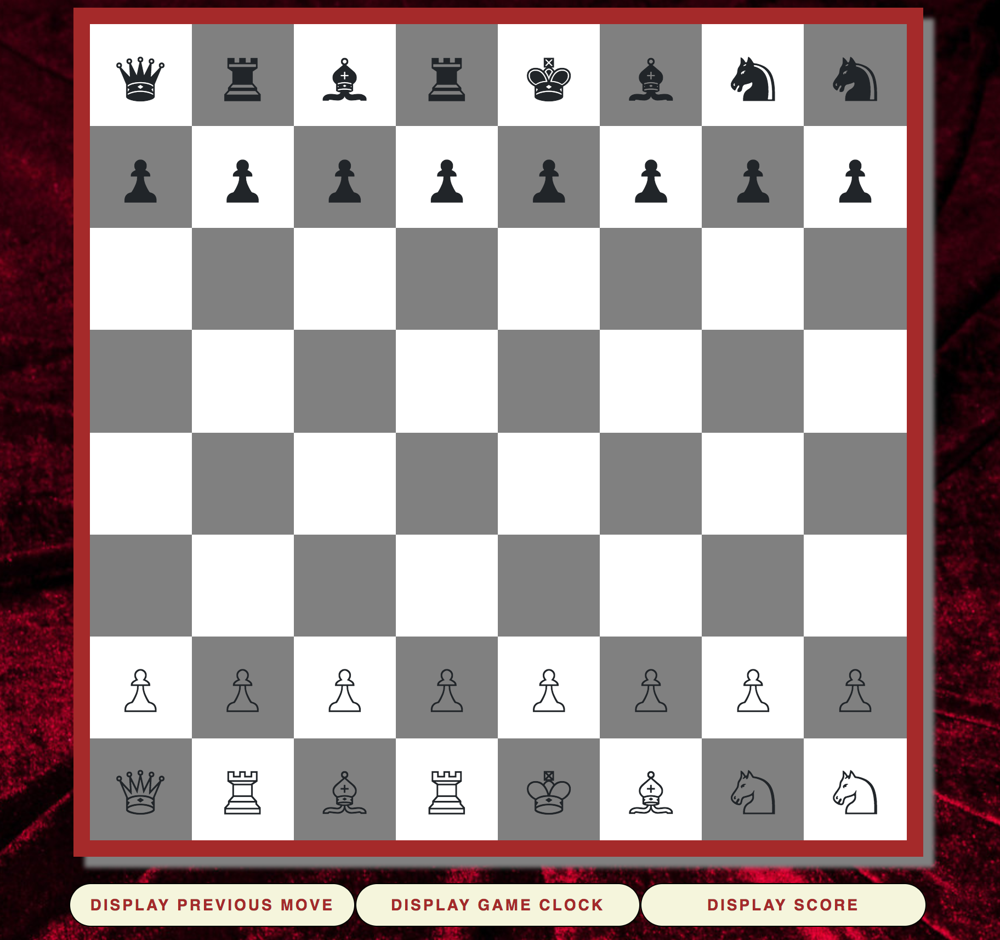
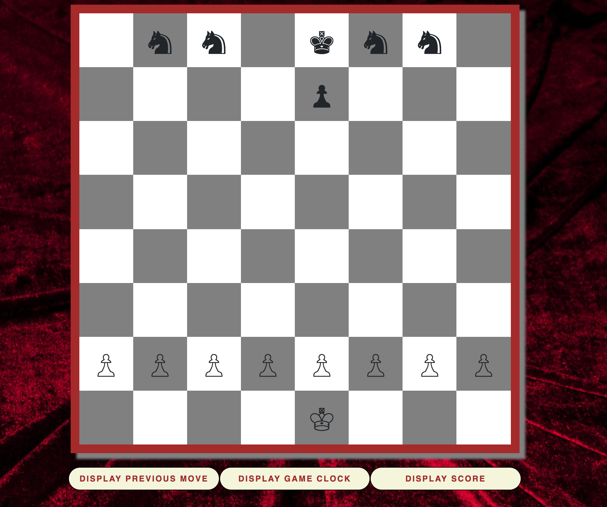

# chess-3

## Background Information
Chess de Tres is my first major program.  It was originally intended to be no more than a 2-person chess game, but as I became more comfortable with what I was doing and finished more than I anticipated, my ambitions grew.  Chess de Tres is now a 2-player chess game that can be played with 2 people, or 1 person against an intelligent Chess AI that is yet to be beaten (even on an easy difficulty), as well as multiple chess game types.  Everything in the game is an original creation, from the board, which is created dynamically with for loops, jquery, and CSS, to the game algorithms that compute a user's legal moves.  There is still much to be accomplished with this, but it is far more than I thought I was capable of and has me really excited for what I can accomplish going forward.

## Process
The process of making the game can easily be split into 3 sections: planning, implementing game logic, and implementing the AI.  I took a very modular approach to the first 2 sections, splitting every function into specific tasks and focusing on having a solid framework before proceeding with anything.  I had the entire flow of the game planned out in pseudocode, which I refactored a few times before I got to the actual coding.  Then the coding was simply a process of turning plain English into a language the computer understands.  This turned out to be not so simple of course, but having the logic and flow planned out ahead of time certainly helped.
My first focus was on the main functionality of chess, getting all the pieces to move as they are allowed.  Once the user could click a piece and move it, I worked on implementing the rules of check, which actually acted as a big change to the code I had already written and was probably the most difficult aspect of the game to implement.  This is because moving a piece can not only put the opponent in check, but can inadvertently put your own king in check.  Moves that put the own king in check needed to be forbidden so I needed a way to check if a move caused self-check.  There were a lot of issues with the transfer of objects and arrays between functions in this and the code had to be rewritten multiple times.  Because my checking for self check function would act on and make changes to my piece objects before handing control of the program back to the piece object find possible moves function, the this keyword in the find possible moves function would no longer refer to itself.  I eventually worked around this by finding all of the possible moves and passing them to the causes self check function, and then looping through each of the moves to see if making that move would put their own king in check.  This was solved by then looping through every opponent piece, checking all of their possible moves, and seeing if any of their possible moves shared a square with the king of the team I was originally looking for.  Of course, this initally caused an infinite loop, as whenever I was finding a possible move, I'd have to loop through all the possible moves of the opponent and then all the possible moves of their opponent, and so on and so fourth.

So I was forced to add a checking for check variable that, if true, would prevent this infinite loop.  The way this was implemented actually also solved the issue of what moves would be possible if your king was already in check, as if the king is already in check and making a move doesn't solve that, then the king would still be in check and the move would be pruned anyways.  

With the main part of the game complete, I moved on to all the extra features that are a part of a complete game of chess: en passant, castling, draws, stalemates, clocks, score, pawn promotion, etc.  Each of these features was tackled one at a time and pretty much each one took multiple hours and a few approaches / refactoring of previous code to implement.

The most difficult functionality to add was probably castling because the king can't castle out of check, into check, or across any squares that an opponent is threatening.  So there was a lot to check for and a lot to write.  En Passant was also difficult because there are a lot of rules regarding en passant.  For example, en passant is only allowed on directly the turn after a pawn has moved 2 spaces forward.  So I needed a way to know if a pawn was sitting on a certain square, was it because they had made a 2 space move, or had they simply made 2 1-space moves.  Did they just make that move, or was the move made a few turns ago?  And finally, is that square directly adjacen to an opposing pawn?

As I worked I continued writing down features I wanted to add at some point, many of which I haven't gotten to and will still be discussed.  Nearly every time I played the game I would discover a new and very specific glitch that would usually take around 45 minutes.  This turned out to be one of the more annoying aspects as I found myself having to play through chess games to debug my game.  

The chess AI was by far the most difficult aspect of the game to debug and there were times I wasn't sure it would be successful.  I started with 2 ideas and ended up using backwards induction to   Because of the nature of the algorithm used, in which it calls itself recursively around 1000 times, it was extremely difficult to pinpoint what was causing glitches when they occurred.  This process took about 2 days before I had a working AI.  There's still work to be done, the algorithm can be improved with alpha-beta pruning and more heuristics, but it is functional and difficult to beat (on the hardest difficulty (which is pretty slow)).  So, how does it work?

# Backwards Induction
Quite simply, backwards induction.  In 2-player games of complete information, backwards induction is used to find a Nash Equilibrium.  Chess can be modeled as a zero-sum game, whereby one player's winnings are directly and exactly the other player's losses.  At each board state, the material value of all the pieces on the board can be summed up and the 2 sides material value can be subtracted to find a value of the game.  The value of the game is from one team's perspective.  So for example if the value of the game is from white's perspective and is 5, that would mean white is up 5 points and black is down by 5 points.  If the value of the game is -5, the opposite is true.  Therefore, black is trying to minimize the value of the game while white is trying to maximize it.

With this understanding, one can make a move tree, of all possible moves and all possible responses, much like the tree below:

In this decision tree it is white's move, but rather than simply look at the outcome of the game after their move, they should project ahead and use backwards induction.  The last person to move in this small game would be black on level 3.  Keeping in mind that black is trying to minimize the value of the game, and assuming they will make a move that best serves them, they would choose +10 over +infinity, and +5 over +7.  Carrying these moves up another level, it is white's turn on level 2.  If we are at the left node, they are choosing between 10 and 5 so they will obviously go with 10.  Over on the right they will choose 5 over -infinity.  These moves can then be carried up again to see what black will do at level 1.  They will choose -10 and -7, and finally, choosing between -10 and -7, player 1 will move to the right and go with -7.  It works no different in my algorithm for chess, there are just many many more combinations to explore.  Which is why this algorithm can be improved with something known as alpha-beta pruning.

# Alpha-Beta Pruning
Because of the number of board states possible in chess (estimated to be 10^120), minimax can be improved with a layer of alpha-beta pruning. By keeping track of alpha (the highest value guaranteed to the maximizer) and beta (the lowest value guaranteed to the minimizer), it is possible to avoid calculating the heuristics of certain board states that cannot improve the situation for the current player.

Credit- https://github.com/lamesjim/Chess-AI

The grayed-out leaf node with a heuristic of 5 is never explored because the maximizer, at that point, is guaranteed a 5 by going left and can do no better than 4 by going right. That is, if the value of the grayed-out leaf node is greater than 4, the minimizer would choose the 4. If it were less than 4, the minimizer would choose it instead. From the maximizer's perspective, there is no reason to investigate that leaf node.

Aside from this, there are many other improvements that can be made to the alogrithm by adding other heuristics that favor things like giving pieces more visibility by calculating how many possible moves a certain move affords them, favoring moves to the center of the board over moves to the outside, favoring moves that put the opponent in check, etc.

## Future Features
Once I moved onto the AI, I was no longer really concerned with improving the 1v1 aspect.  Having moved on from the AI to game types, I am now most interested in creating many more game types to play as I think this is what could set my game apart from others.  I was trying to play horde chess online against a computer, because as I was browsing chess variants in wikipedia it looked really cool, but I couldn't find a single place to play it.  The fact that a chess game offering chess variants doesn't exist leaves a void that my game could fill.  Especially since most other chess AIs are certainly more sophisticated than mine, this is the first thing I would like to implement.  Additionally, a lot of the chess variants are very easy to make as they use the same logic I have already created.  Heck, I added horde chess in about 20 minutes this morning!  
After chess variants, there a few very minor glitches to iron out and minor features to complete the game.  First of all, the only rule I didn't implement is a draw by three-fold repetition.  I have a draw by insufficient mating materials which occurs when neither side posses enough to mate the opposing king, and I have stalemates, when a player has no legal move but is not in check.  Additionally, there is a very minor glitch that would probably almost never occur, but if a player promotes their pawn and the promotion puts the other side in checkmate, the game won't recognize it as checkmate is checked before the player has finished the popup form.  This would probably be an easy fix, but being so minor, and with my focus on Ai and chess variants, I haven't really considered fixing it.  
After this there a few other improvements and features I'd like to be able to add to my game.
-First, an undo button, which would probably not prove too difficult to add.
-Secondly, I thought about showing captured pieces on either side of the board, or allowing the user to view captured pieces by clicking a button.
-I thought about improving the show last move functionality so if a piece is captured it will show that.
-Piece movement animation (could be annoying or overkill).
-Message telling player they're in check.  This one I actually still want to implement.  I think it'd be easy and make a difference as when people don't realize they're in check and try and make a move but can't, they think the game is broken.  I've actually even done that playing other chess apps so I know it is a common phenomenon.

Another big feature I want to implement is the ability to choose from a list of famous games or game setups, and either watch them unfold, or play them, against the computer, from the point where a grandmaster made a genius move.

The trello board below was used to prioritize and keep track of all of the additional features I was working on and wanted to work on.

-https://trello.com/b/zRASIRTI/chess-3

## Why the name?
When I started the project over the weekend, I thought I would be cool and start a local repo rather than make a remote one and clone.  This failed, twice, and not understanding how to delete a remote repo and concerned I might destroy any code, I decided to play it safe (after about 15 minutes of trying with chess 1 and 2) and just create a remote repo on github and pull from there.  Thus, chess 3.

## Current chess variants

Chess 960:

Also known as Fischer Random, this is probably the most well known and popular of the chess variants.  Invented by Bobby Fischer in the late 90s as a way of preventing the typically memorized openings of chess by the pros, chess 960 improved upon shuffle chess by adding some restrictions.  The pawns are placed as normal, while the back rows are completely randomized with 2 restrictions: the bishops must be on opposite colors, and there must be a rook on either side of the king allowing the king to castle on either side regardless of how far away the rooks are.  My version does not include the rook restriction and does not allow for castling.

Horde Chess:

One side has standard chess pieces while the other side has 32 pawns.

Peasant's Revenge:

One side has a row of pawns and is facing off against an opposing king with a small army of knights.  Black has the advantage.

# Acknowledgments
* Nelley
